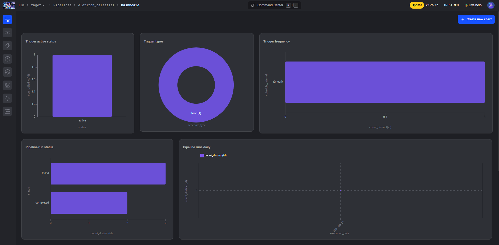

# LLM Pipeline Orchestration with Mage 

## 🔍 Overview

This project orchestrates a Retrieval-Augmented Generation (RAG) pipeline using `Mage` for managing large language models (LLMs). The pipeline is designed to run on an hourly schedule, automating the ingestion, chunking, tokenization, indexing, and retrieval of documents using `Elasticsearch` as a vector database. The system supports full updates to keep the document index synchronized with evolving data sources, such as frequently updated FAQ documents.

## 🚀 Running the Pipeline

Follow these steps to run the pipeline:

```bash
# Clone the repository
git clone https://github.com/Mannerow/llm-homework-05.git

# Navigate to the project directory
cd llm-homework-05

# Start the Mage environment
./scripts/start.sh
```

## 🛠️ How It Works

1. Ingest: The pipeline begins by ingesting FAQ documents directly from Google Docs using their unique file IDs. The documents are downloaded in DOCX format and parsed into structured data, including fields like course, section, question, and text.

2. Chunk: The structured documents are then split into chunks, each corresponding to a specific question and answer. A unique document_id is generated for each chunk using a hash of the course, question, and the start of the text, ensuring each chunk can be individually identified later.

3. Tokenization (Optional): While not required for this pipeline, tokenization can be added if needed for more complex processing, such as creating embeddings. For this setup, tokenization is skipped in favor of text-based search.

4. Indexing: Each chunk, along with its metadata, is indexed in Elasticsearch. The indexing process includes setting up the index with specific configurations like the number of shards and replicas, allowing for efficient search and retrieval.

5. Retrieval: The pipeline supports querying the Elasticsearch index to retrieve the most relevant chunks based on a search query. A match query searches the text field, returning the top results based on the query.

## 🖥️ Viewing the Mage UI

Once the pipeline is running, you can view and manage it through the Mage UI. Simply navigate to http://localhost:6789 in your browser.

Navigate to the `Pipelines` section and select `Dashboard` to view detailed charts on pipeline run status, trigger activity, trigger types, and trigger frequency.



